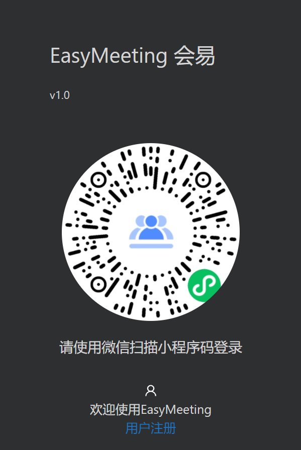
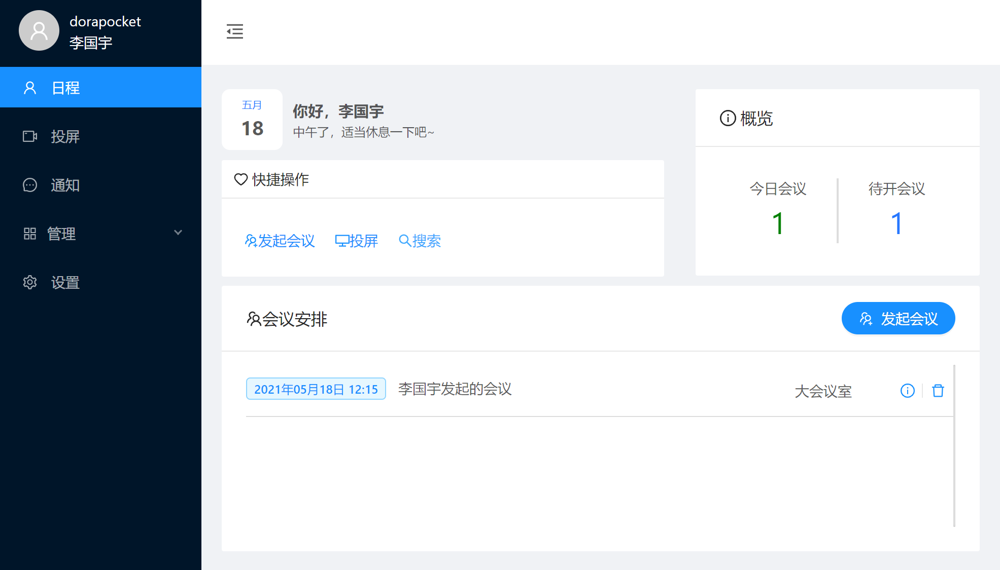
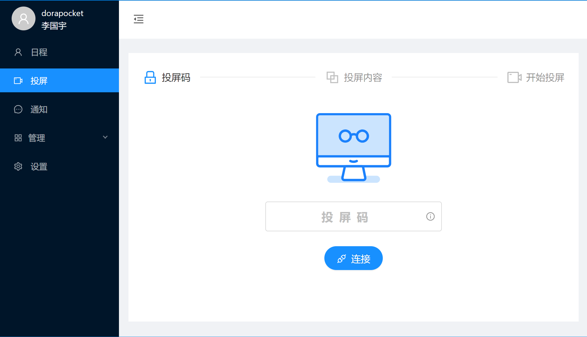
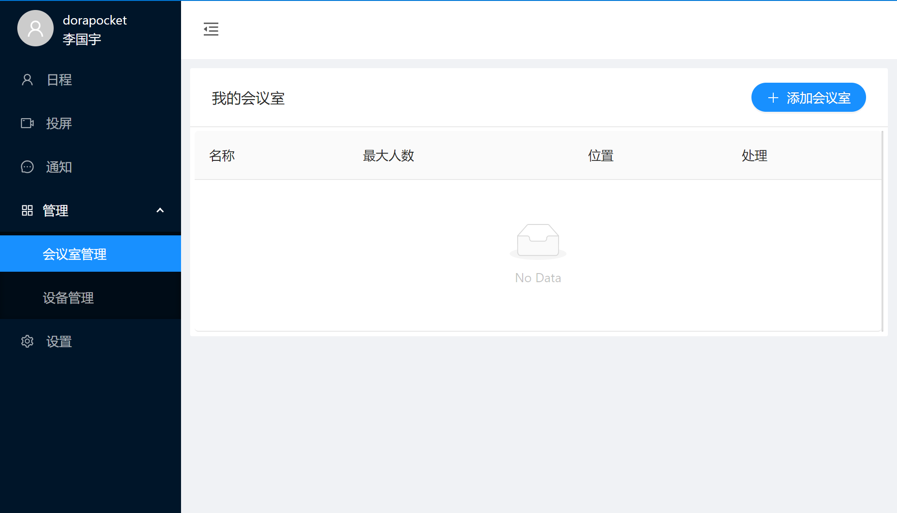
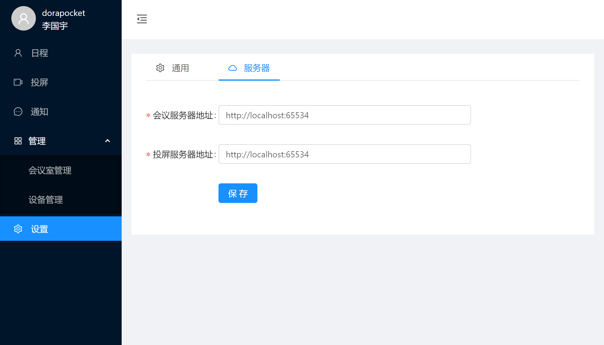
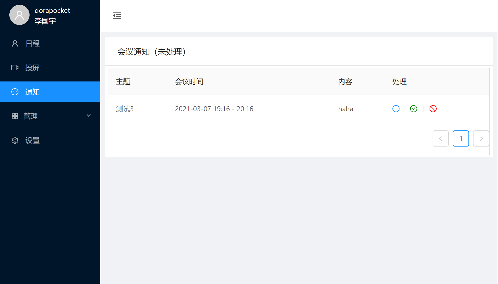

# Easymeeting-Client

> EasyMeeting-Client 会易 智能会议室管理系统 V1.0

## About Easymeeting

“会易”是一款专为会议室打造的智能会议解决方案。
“会易”支持会议室创建与管理、会议室预约、会议预约、签到、迟到抢占、无线投屏等多种功能。有自己的用户体系，并支持微信小程序绑定和扫码登陆。

Easymeeting is an meeting solution specially built for conference rooms.
Easymeeting supports various functions such as conference room creation and management, conference room reservation, meeting reservation, check-in, room preemption, wireless screen casting, etc. Has its own user system, and support wechat miniprogram binding and wechat scan login.

## About This Project
本工程是客户端部分代码。
This project is part of the client code.

支持功能 Support functions: 
- [x]  用户登录和注册 User login and registration
- [x]  小程序扫码登陆 Miniprogram scan code login
- [x]  会议预约  Meeting appointment
- [x]  个人任务查看 Personal Task
- [x]  WebRTC无线投屏 Wireless screen casting
- [x]  多系统支持（Mac、Win、Linux）Multi-system support
- [x]  会议室管理 Conference room management
- [x]  设备管理 Device management
- [ ]  设备绑定（小程序实现）Device binding (applet implementation)
- [ ]  会议签到（小程序实现）Meeting check-in (applet implementation)
- [ ]  会议室抢占（小程序实现）Meeting room preemption (small program implementation)
- [x]  会议邀请处理 Meeting invitation processing
- [ ]  设置 Settings

## ScreenShots
扫码登陆页面 Scan Login



主页 Index



投屏页面 Wireless screen casting



会议室管理页面 Conference room management



设置页面 Settings



通知页面 Notice



## Develop


欢迎提pr或更好的idea！

Welcome to submit PR or better idea!

``` bash
# install dependencies
yarn install

# serve with hot reload at localhost:9080
npm run dev

# build electron application for production
npm run build

#build windows exe
yarn run build:win
```

---

This project was generated with [electron-vue](https://github.com/SimulatedGREG/electron-vue) using [vue-cli](https://github.com/vuejs/vue-cli). Documentation about the original structure can be found [here](https://simulatedgreg.gitbooks.io/electron-vue/content/index.html).
